<h1 align="center">Pedro Pimentel Moura</h1>

  Computer Science - PUCPR | Software Development & Data

  
  

---

### About

Computer Science student at **PUCPR** with an interest in software development, data and technology.

Currently developing projects and expanding my experience with programming, databases, data analysis and business intelligence.

### Technologies

  

  
  
  
  

### Currently

- Studying **Computer Science at PUCPR**
- Developing skills in **Data & Analytics**
- Building software and data-driven projects
- Exploring databases, data visualization and business intelligence

  

### Featured Projects

Check out my pinned repositories below ↓
